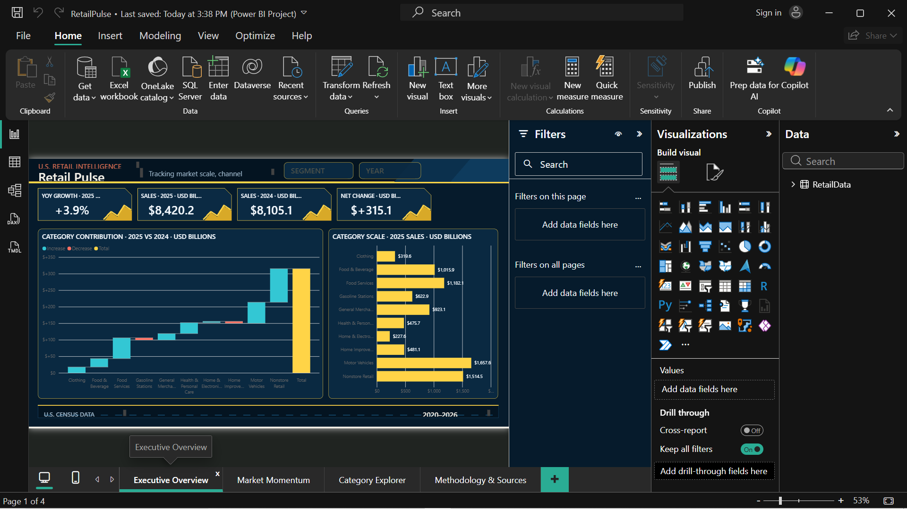

# Retail Pulse

A Power BI retail intelligence dashboard built from the U.S. Census Bureau Monthly Retail Trade Survey.

## What the dashboard answers

- Which retail categories contributed most to the latest complete-year sales movement?
- How did 2025 sales compare with the comparable 2024 base?
- Which categories combine meaningful scale with positive or negative momentum?
- How do category and segment trajectories differ across the available period?

## Dashboard pages

- **Executive Overview** — complete-year KPIs, category contribution waterfall, and category scale ranking.
- **Market Momentum** — category growth-versus-scale analysis and prior-year benchmark.
- **Category Explorer** — interactive category trajectory and detailed benchmark table.
- **Methodology & Sources** — metric definitions, coverage, limitations, and interpretation guidance.

## Data and methodology

- **Source:** U.S. Census Bureau, Monthly Retail Trade Survey.
- **Coverage:** January 2020 through May 2026.
- **Default executive comparison:** calendar year 2025 versus 2024, because 2026 is partial through May.
- **Units:** source figures are millions of current U.S. dollars; executive values are converted to USD billions.
- **Double-counting control:** the aggregate `Total Market` series is excluded from category-level contribution and ranking calculations.

## Limitations

- Recent Census estimates may be revised.
- Values are seasonally adjusted but are not inflation-adjusted.
- Partial 2026 results must not be interpreted as a complete-year decline.
- The dashboard is descriptive and does not establish causal relationships.

## Open the Power BI project

Download `Retail_Pulse_PBIP.zip`, extract it, and open `RetailPulse.pbip` using a current version of Power BI Desktop.
